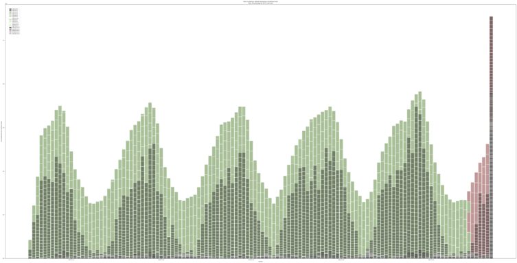

# ClickHouse Parts Chart



## Prerequisites

Matplotlib and ClickHouse Driver library, eg:

```shell
pip3 install matplotlib clickhouse_driver
```

## Usage

Example:

```shell
clickhouse-parts clickhouse.local default.flights flights.png
```

Or, using daemontools:

```shell
#!/bin/sh
while sleep 600 ; do
  curl -sG http://clickhouse.local:8123 --data-urlencode \
    "query=SHOW TABLES" | grep whitelist | grep -v blacklist | \
     while read table ; do clickhouse-parts clickhouse.local \
       default.$table /var/www/charts/$table.png
  done
done
```

## Limitations

Chart layout is fairly fixed in the code, would like to have it more easily
adjustable
